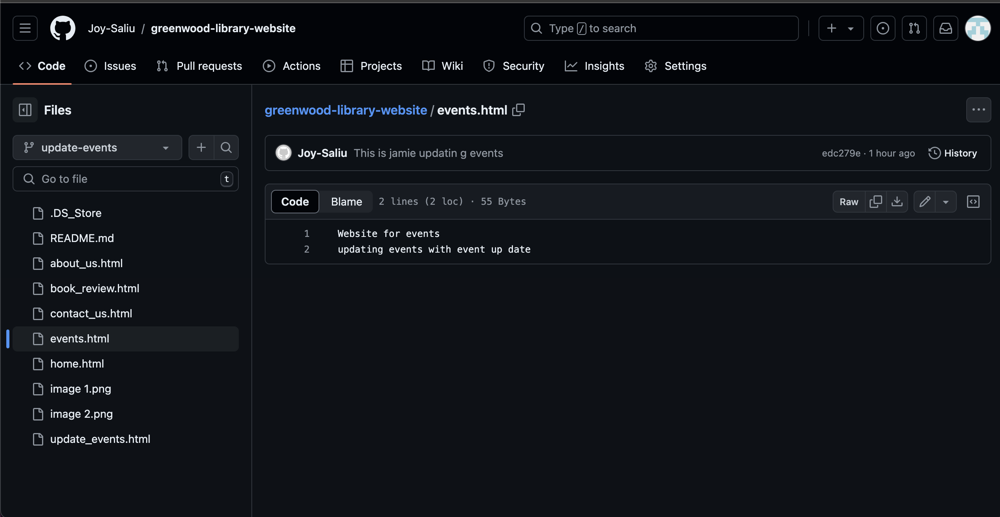

# greenwood-library-website #
#### This project is a Greenwood Community Library Website. HTML files where created, staged, commited and pushed. Two branches for Morgan and jammie named add-book-reviews and updated-events respectively were also created,commited and pushed. each branch was pulled in to the main brasnch after comparison and merged.
*Created files on the main page; stage,commit and pushed them.
- home.html
- events.html
- about_us.html
- contact_us.html
> 
 - Created and switched to a new branch named "add-book-reviews".
Staged, commit and pushed changes.   
 -  Pushed the add-book-reviews branch to github and raised a pull request for Morgan's work.

- Merged Morgan's work to the main branch. 
- Created and switched to Jammies branch named "update-events". 
- Jammie updated events page and staged commit and pushed changed.           
- Staged, commit and pushed changes to updated-events.     
- Pulled the latest changes from the main branch into update-events before raising a pull request.
>  
## This project was worked on by Admin, Morgan and Jamie. It was a good team effort that encourage communication, patience and time management

 
